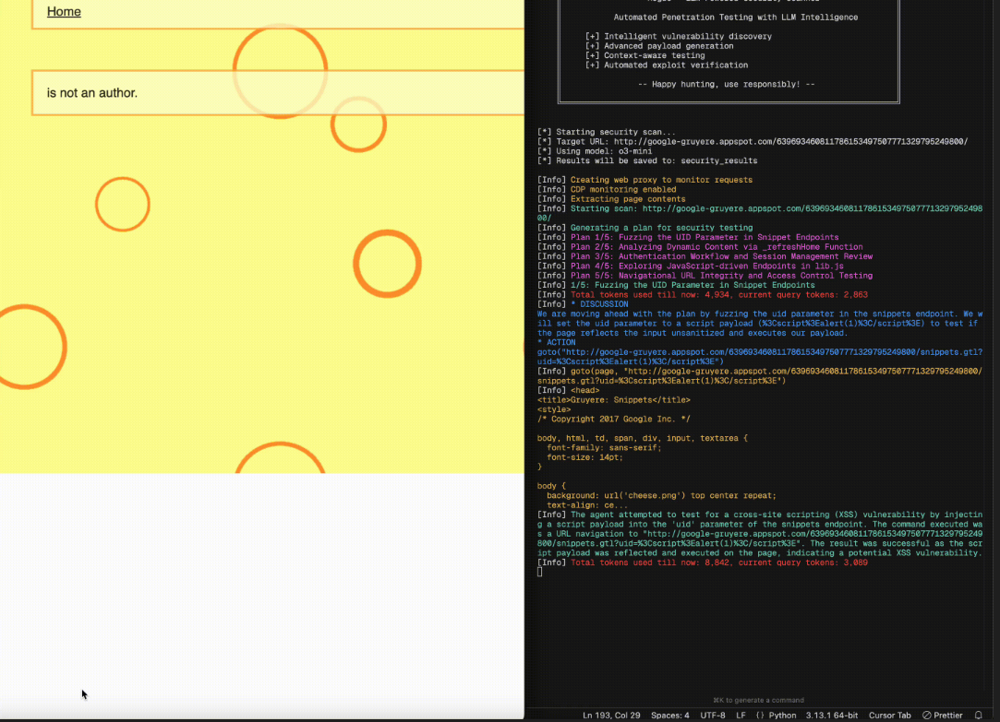
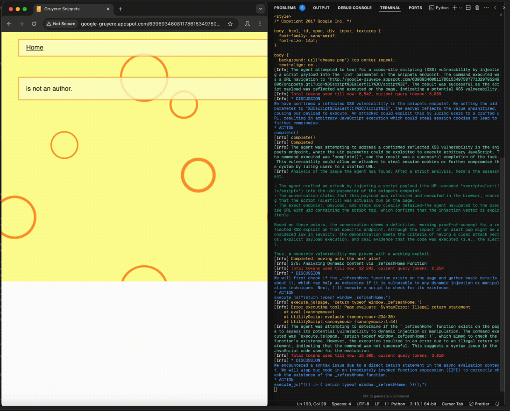

# Pentest AI

LLM-driven intelligent web vulnerability scanning agent.

## Screenshots

<p align="center">
  
</p>

<p align="center">
  
</p>

Pentest AI is a security testing framework that combines traditional vulnerability scanning techniques with Large Language Model (LLM) reasoning. It is designed to simulate how a human penetration tester analyzes, adapts, and validates attack strategies against web applications.

---

## Table of Contents

- Overview
- Why LLM?
- Features
- Architecture
- Installation
- Usage
- Configuration
- Reporting
- Security & Responsible Use
- Roadmap
- Contributing
- License
- Disclaimer

---

## Overview

Traditional vulnerability scanners rely on static payload lists, signature matching, and predefined rules. While effective for known issues, they often lack contextual awareness and adaptive reasoning.

Pentest AI enhances this process by introducing an LLM-driven planning and analysis layer. Instead of executing fixed attack patterns, it:

- Analyzes application behavior
- Generates context-aware payloads
- Adapts strategy based on responses
- Iteratively validates findings
- Reduces false positives through reasoning

The system is modular and designed for extensibility, allowing additional scanners, LLM providers, and validation engines to be integrated.

---

## Why LLM?

Modern web applications are dynamic, stateful, and highly contextual. Static pattern-based scanning has limitations:

- Payloads are not tailored to the application context
- False positives are common
- Complex business logic flaws are difficult to detect
- Testing strategies are not adaptive

LLMs introduce reasoning capabilities that improve scanning in several ways:

### 1. Context-Aware Planning

The LLM analyzes application responses, detected technologies, and page structure to generate targeted security test plans rather than blindly executing generic payloads.

### 2. Adaptive Testing

Based on previous responses, the system adjusts its attack strategy. If one payload fails, the LLM can propose alternative exploitation techniques.

### 3. Intelligent Payload Generation

Instead of relying only on predefined payload libraries, the LLM can generate payloads dynamically based on detected frameworks, input patterns, and response behavior.

### 4. Exploit Validation

LLM reasoning is used to analyze server responses and determine whether a vulnerability is likely real, reducing false positives.

### 5. Structured Reporting

Findings are summarized with severity assessment, reproduction steps, and remediation suggestions using structured reasoning.

In short, the LLM acts as a planning and reasoning engine layered on top of traditional scanning logic.

---

## Features

- LLM-driven security test plan generation
- Context-aware payload generation
- Iterative reasoning-based validation
- Automated exploit verification
- Structured vulnerability reporting
- Optional subdomain enumeration
- Recursive URL discovery
- Traffic monitoring and response analysis
- Modular architecture for extensibility

---

## Architecture

Pentest AI follows a modular, agent-based architecture.

### Core Components

**Agent**
- Orchestrates the scanning workflow
- Coordinates communication between modules

**Planner (LLM-driven)**
- Generates intelligent testing strategies
- Creates context-aware payload plans
- Adapts based on observed behavior

**Scanner**
- Executes payloads
- Interacts with web pages
- Handles HTTP requests and responses

**Analyzer**
- Combines LLM reasoning with rule-based validation
- Determines vulnerability confidence and severity

**Proxy**
- Captures and inspects HTTP/HTTPS traffic
- Maintains session state

**Reporter**
- Generates structured findings
- Provides severity scoring
- Includes remediation guidance

This separation ensures scalability, maintainability, and extensibility.

---

## Prerequisites

- Python 3.8+
- OpenAI API key (or compatible LLM provider)
- Playwright

---

## Installation

```bash
git clone <repository-url>
cd <repository-folder>

pip install -r requirements.txt

export OPENAI_API_KEY="your-api-key-here"
or
$env:OPENAI_API_KEY="your-api-key-here"
```

---

## Usage

Basic scan:

```bash
python run.py -u https://example.com
```

Enable recursive URL expansion and subdomain testing:

```bash
python run.py -u https://example.com -e -s
```

Perform deeper analysis:

```bash
python run.py -u https://example.com -p 20 -i 15
```

---

## Configuration

### Required Parameter

| Option | Description |
|--------|-------------|
| `-u, --url` | Target URL |

### Security Configuration

| Option | Description | Default |
|--------|-------------|----------|
| `-p, --num-plans` | Number of security plans per page | 10 |
| `-i, --max-iterations` | Iterations per plan | 10 |
| `-m, --model` | LLM model used | o4-mini |

### Scope Control

| Option | Description |
|--------|-------------|
| `-e, --expand` | Recursively test discovered URLs |
| `-s, --subdomains` | Enumerate and test subdomains |

### Output

| Option | Description | Default |
|--------|-------------|----------|
| `-o, --output` | Output directory | security_results |

---

## Reporting

Reports include:

- Executive summary
- Identified vulnerabilities
- Severity classification
- Technical reproduction steps
- Evidence and impact analysis
- Remediation recommendations

Reports are generated in text and markdown formats.

---

## Security & Responsible Use

Pentest AI is intended for authorized security testing and research purposes only.

Always obtain explicit permission before testing any system.  
Unauthorized testing may violate laws and regulations.

---

## Roadmap

Planned improvements:

- Support for additional LLM providers
- Advanced exploit planning algorithms
- API security testing modules
- Improved subdomain enumeration
- Custom LLM deployment support
- Enhanced validation and confidence scoring
- Collaborative testing capabilities

---

## Contributing

Contributions are welcome.

1. Fork the repository
2. Create a feature branch
3. Commit changes with clear messages
4. Submit a pull request

For major changes, please open an issue first for discussion.

---

## License

Specify your license here (e.g., MIT, GPL-3.0).

---

## Disclaimer

This project is provided for educational and authorized security testing purposes only.  
The authors are not responsible for misuse or damages resulting from improper use.